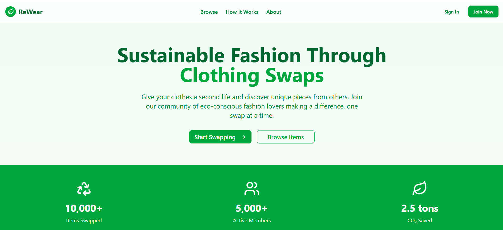
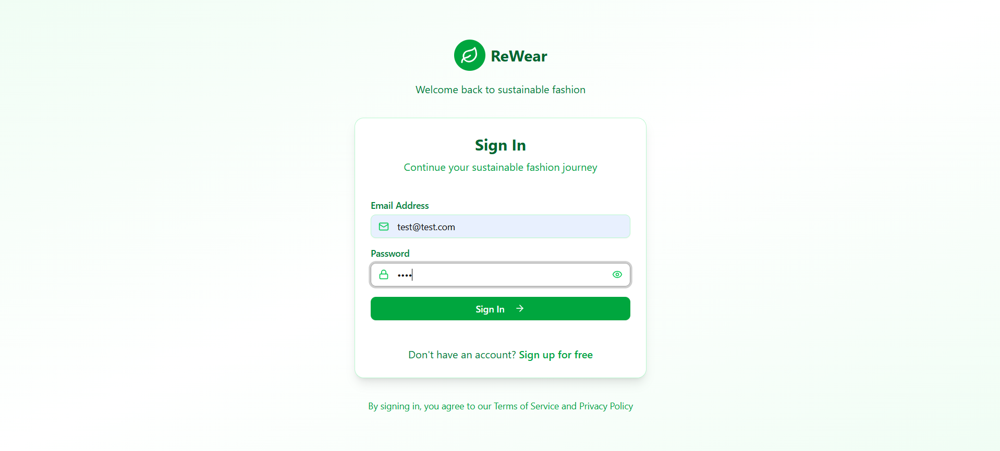
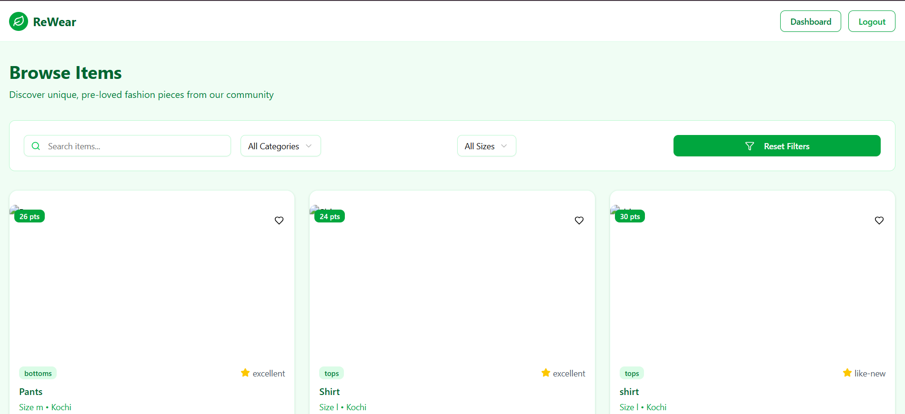
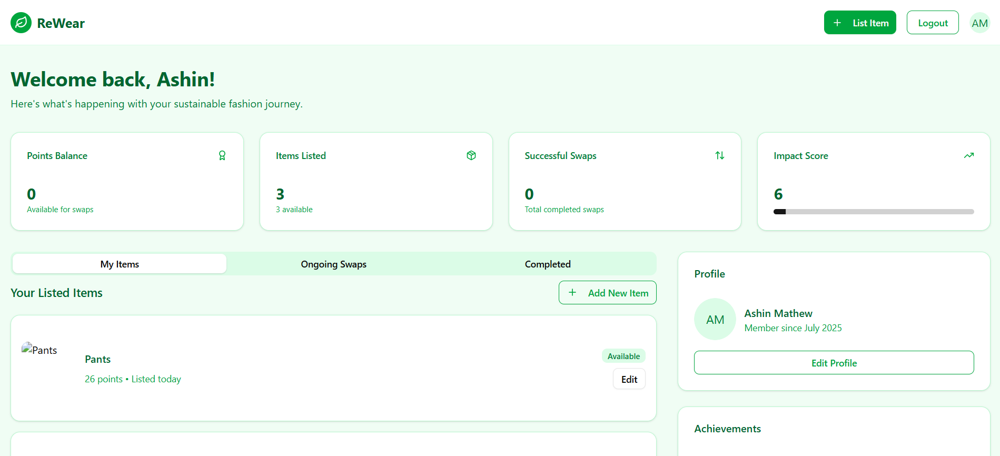
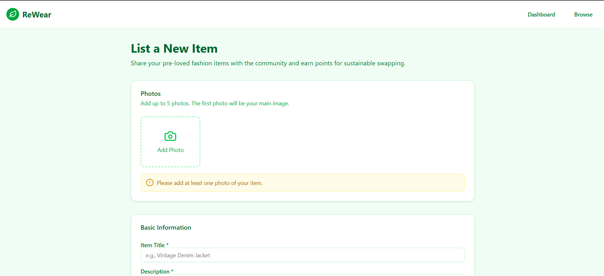
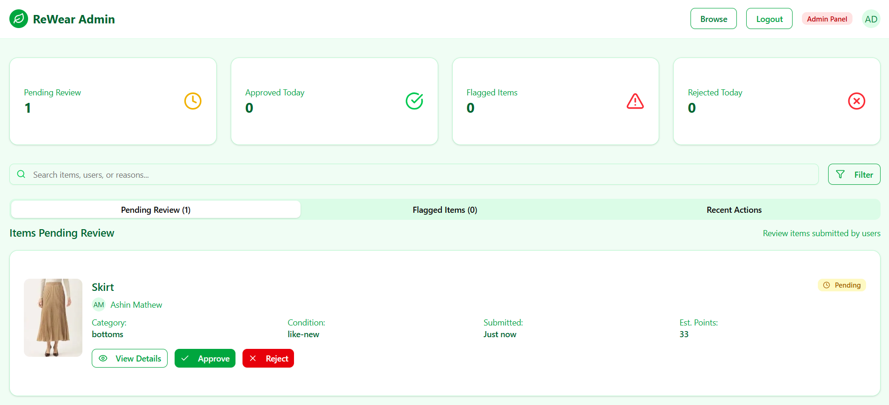

# Odoo Hackathon 2025
# ReWear – A Sustainable Fashion Swap Platform

**ReWear** is a full-stack web application built with **Next.js App Router**, designed to promote **sustainable fashion** by enabling users to exchange unused clothing through **direct swaps** or a **point-based redemption system**. This platform encourages users to reuse wearable garments instead of discarding them.

---

## Features

###  User Functionality
- Email/password authentication
- User profile with points balance
- Upload clothes with images, descriptions, and tags
- Browse, filter, and view available items
- Request swaps or redeem with points
- Track ongoing and completed swaps

###  Admin Functionality
- Lightweight admin dashboard
- Moderate and approve/reject listings
- Remove inappropriate or spam items

---

##  Tech Stack

| Layer         | Tech Used                       |
|---------------|---------------------------------|
| Framework     | **Next.js (App Router)**        |
| Styling       | Tailwind CSS                    |
| Database      | **NeonDB (PostgreSQL)**         |
| Image Upload  | **Cloudinary**                  |
| Auth          | NextAuth.js                     |
| Hosting       | Vercel                          |

---

## Folder Structure Overview

```bash
app/
├── add-item/        # Page to upload new clothes
├── admin/           # Admin dashboard and controls
├── api/             # API routes (Next.js API handlers)
├── auth/            # Authentication (NextAuth)
├── browse/          # Page to browse all items
├── dashboard/       # User dashboard
├── item/            # Dynamic item detail page
├── layout.tsx       # App layout wrapper
├── page.tsx         # Landing page
components/          # Reusable UI components
lib/                 # Utility functions (e.g. DB connection, auth)
public/              # Static files
prisma/              # Prisma schema
.env.local           # Environment variables
README.md            # You're reading it!
```

---

## Getting Started

### 1. Clone the Repository
```bash
git clone https://github.com/AshinSMathew/rewear.git
cd rewear
```

### 2. Install Dependencies
```bash
npm install
```

### 3. Setup Environment Variables
Create a `.env.local` file in the root folder and add the following:
```bash
# NeonDB (PostgreSQL)
DATABASE_URL="postgresql://<user>:<password>@<your-neon-host>.neon.tech/<dbname>?sslmode=require"

# Cloudinary
CLOUDINARY_CLOUD_NAME=your_cloud_name
CLOUDINARY_API_KEY=your_api_key
CLOUDINARY_API_SECRET=your_api_secret

JWT_SECRET=some-random-secret
```

### 4. Run the Development Server
```bash
npm run dev
```
Visit `http://localhost:3000` to view the app.

---

## Screenshots


HOME PAGE


LOGIN PAGE

#### Client Side

BROWSE PAGE


DASHBOARD PAGE


ADD ITEM PAGE

#### Admin Side

ADMIN PAGE


